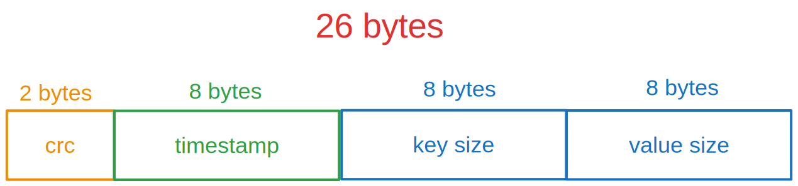

# Go Bitcask

Bitcask implementation based on https://riak.com/assets/bitcask-intro.pdf

- A key/value store
- a Bitcask instance is a directory
- One file is active in that directory for writing
- When the file meets a size threshold, it will be closed and a new active file will be created
- Files are immutable after closed (on purpose or server exits)
 
 
# Active File

## Header

    

